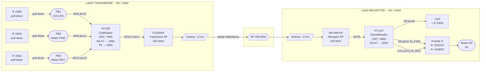
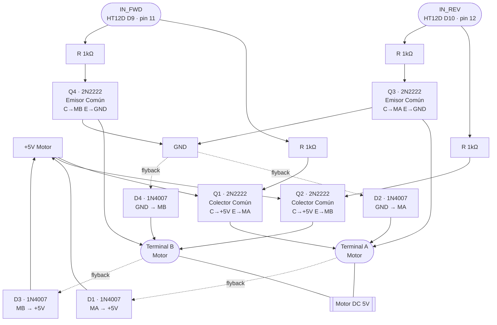

# Diagrama de Conexión — RF 433 MHz con HT12E / HT12D

## Descripción General del Sistema

Este proyecto implementa un sistema de control inalámbrico a **433 MHz** usando el codificador **HT12E** en el lado transmisor y el decodificador **HT12D** en el lado receptor.

**Funcionalidades:**
- **PB1** → Enciende/apaga un LED remotamente vía RF.
- **PB2** → Gira el motor DC 5V en sentido **horario** (Forward).
- **PB3** → Gira el motor DC 5V en sentido **antihorario** (Reverse).

El control del motor se realiza mediante un **Puente H** construido con cuatro transistores **2N2222** (NPN).

---

## Lista de Componentes

| Cantidad | Componente                      | Descripción                                |
|----------|---------------------------------|--------------------------------------------|
| 1        | HT12E                           | Codificador serial 12-bit (18 pines DIP)   |
| 1        | HT12D                           | Decodificador serial 12-bit (18 pines DIP) |
| 1        | FS1000A                         | Módulo transmisor RF 433 MHz               |
| 1        | MX-RM-5V                        | Módulo receptor RF 433 MHz                 |
| 3        | Push Button (momentáneo)        | PB1, PB2, PB3                              |
| 4        | Transistor 2N2222 (NPN)         | Puente H para control de motor             |
| 4        | Diodo 1N4007                    | Protección flyback del Puente H            |
| 1        | Motor DC 5V                     | Motor de corriente directa                 |
| 1        | LED (cualquier color)           | Indicador luminoso receptor                |
| 3        | Resistencia 10 kΩ               | Pull-down AD8, AD9, AD10 (HT12E)           |
| 4        | Resistencia 1 kΩ                | Base de transistores 2N2222                |
| 1        | Resistencia 330 Ω               | Limitadora de corriente del LED            |
| 1        | Resistencia 1 MΩ                | Oscilador HT12E                            |
| 1        | Resistencia 33 kΩ               | Oscilador HT12D                            |
| 2        | Fuente / batería 5 V            | Una para TX, una para RX                   |
| 2        | Antena ~17 cm (hilo)            | FS1000A y MX-RM-5V                         |

---

## Módulos RF 433 MHz

### FS1000A — Transmisor

| Pin   | Descripción                          |
|-------|--------------------------------------|
| GND   | Tierra                               |
| VCC   | Alimentación 3.5 V – 12 V (usar 5 V)|
| DATA  | Entrada de datos seriales (HT12E DOUT)|
| ANT   | Antena (~17 cm de hilo a 433 MHz)    |

### MX-RM-5V — Receptor

| Pin        | Descripción                           |
|------------|---------------------------------------|
| VCC        | Alimentación 5 V                      |
| DATA (×2)  | Salida de datos (usar cualquiera de los dos) |
| GND        | Tierra                                |
| ANT        | Antena (~17 cm de hilo a 433 MHz)     |

---

## HT12E — Codificador (Transmisor)

**Pinout (DIP-18):**

| Pin | Nombre | Función en este proyecto                        |
|-----|--------|-------------------------------------------------|
| 1   | A0     | Pin de dirección → GND                          |
| 2   | A1     | Pin de dirección → GND                          |
| 3   | A2     | Pin de dirección → GND                          |
| 4   | A3     | Pin de dirección → GND                          |
| 5   | A4     | Pin de dirección → GND                          |
| 6   | A5     | Pin de dirección → GND                          |
| 7   | A6     | Pin de dirección → GND                          |
| 8   | A7     | Pin de dirección → GND                          |
| 9   | VSS    | GND                                             |
| 10  | AD8    | Dato D8 — Pull-down 10 kΩ + PB1 a VCC          |
| 11  | AD9    | Dato D9 — Pull-down 10 kΩ + PB2 a VCC          |
| 12  | AD10   | Dato D10 — Pull-down 10 kΩ + PB3 a VCC         |
| 13  | AD11   | Dato D11 — No usado, conectar a GND             |
| 14  | TE     | Transmisión habilitada (activo LOW) → **GND**   |
| 15  | OSC2   | Oscilador — resistencia 1 MΩ entre OSC1 y OSC2  |
| 16  | OSC1   | Oscilador — resistencia 1 MΩ entre OSC1 y OSC2  |
| 17  | DOUT   | Salida serial → DATA del FS1000A                |
| 18  | VDD    | VCC (+5 V)                                      |

> **Lógica de datos:** los pines AD8–AD11 usan lógica activa HIGH.
> Pull-down de 10 kΩ a GND mantiene el pin en LOW (reposo).
> Al presionar el botón, el pin sube a VCC (HIGH) → dato '1' transmitido.
> El HT12D reflejará esa misma lógica en sus salidas D8–D11.

> **Dirección:** A0–A7 todos a GND → dirección `0x00`. Debe coincidir exactamente con el HT12D.

---

## HT12D — Decodificador (Receptor)

**Pinout (DIP-18):**

| Pin | Nombre | Función en este proyecto                            |
|-----|--------|-----------------------------------------------------|
| 1   | A0     | Pin de dirección → GND                              |
| 2   | A1     | Pin de dirección → GND                              |
| 3   | A2     | Pin de dirección → GND                              |
| 4   | A3     | Pin de dirección → GND                              |
| 5   | A4     | Pin de dirección → GND                              |
| 6   | A5     | Pin de dirección → GND                              |
| 7   | A6     | Pin de dirección → GND                              |
| 8   | A7     | Pin de dirección → GND                              |
| 9   | VSS    | GND                                                 |
| 10  | D8     | Salida — activa LED (330 Ω → LED → GND)             |
| 11  | D9     | Salida — IN_FWD del Puente H (Forward)              |
| 12  | D10    | Salida — IN_REV del Puente H (Reverse)              |
| 13  | D11    | Salida — no usada                                   |
| 14  | DIN    | Entrada serial ← DATA del MX-RM-5V                  |
| 15  | OSC2   | Oscilador — resistencia 33 kΩ entre OSC1 y OSC2     |
| 16  | OSC1   | Oscilador — resistencia 33 kΩ entre OSC1 y OSC2     |
| 17  | VT     | Valid Transmission (HIGH cuando hay señal válida)   |
| 18  | VDD    | VCC (+5 V)                                          |

> **Dirección:** A0–A7 todos a GND → dirección `0x00`. Debe coincidir con el HT12E.

---

## Diagrama General del Sistema



---

## Esquemáticos ASCII

### TX — HT12E Codificador + Botones + FS1000A

```
                  ┌─────────────────┐
    GND ── A0 (1) ┤                 ├ (18) VDD ──── +5V
    GND ── A1 (2) ┤                 ├ (17) DOUT ─────────────────── FS1000A DATA
    GND ── A2 (3) ┤                 ├ (16) OSC1 ──┐
    GND ── A3 (4) ┤    HT12E        ├ (15) OSC2 ──┴── [R 1MΩ]
    GND ── A4 (5) ┤  Codificador    ├ (14) TE ─────── GND
    GND ── A5 (6) ┤                 ├ (13) AD11 ───── GND
    GND ── A6 (7) ┤                 ├ (12) AD10 ───── [R 10kΩ] ── GND
    GND ── A7 (8) ┤                 ├ (11) AD9  ───── [R 10kΩ] ── GND
    GND ─ VSS (9) ┤                 ├ (10) AD8  ───── [R 10kΩ] ── GND
                  └─────────────────┘     │            │            │
                                         PB3          PB2          PB1
                                          │            │            │
                                         +5V          +5V          +5V

    FS1000A: VCC→+5V  ·  GND→GND  ·  DATA←DOUT(p17)  ·  ANT→ ~17 cm hilo
```

### RX — MX-RM-5V + HT12D Decodificador + Salidas

```
                  ┌─────────────────┐
    GND ── A0 (1) ┤                 ├ (18) VDD ──── +5V
    GND ── A1 (2) ┤                 ├ (17) VT  ──── (señal válida, opcional)
    GND ── A2 (3) ┤                 ├ (16) OSC1 ──┐
    GND ── A3 (4) ┤    HT12D        ├ (15) OSC2 ──┴── [R 33kΩ]
    GND ── A4 (5) ┤  Decodificador  ├ (14) DIN ──── MX-RM-5V DATA
    GND ── A5 (6) ┤                 ├ (13) D11 ──── (no usado)
    GND ── A6 (7) ┤                 ├ (12) D10 ──── IN_REV ──► Puente H
    GND ── A7 (8) ┤                 ├ (11) D9  ──── IN_FWD ──► Puente H
    GND ─ VSS (9) ┤                 ├ (10) D8  ──── [R 330Ω] ──► LED ──► GND
                  └─────────────────┘

    MX-RM-5V: VCC→+5V  ·  GND→GND  ·  DATA→DIN(p14)  ·  ANT→ ~17 cm hilo
```

### Puente H — 4× 2N2222 NPN

```
                        +5V
                         │
                   ┌─────┴─────┐
                  (C)         (C)
   IN_FWD──[1kΩ]─(B) Q1    Q2 (B)─[1kΩ]──IN_REV
                  (E)         (E)
                   │           │
                  MA ──[M]── MB                    [M] = Motor DC 5V
                   │           │
                  (C)         (C)
   IN_REV──[1kΩ]─(B) Q3    Q4 (B)─[1kΩ]──IN_FWD
                  (E)         (E)
                   │           │
                   └─────┬─────┘
                        GND

    Diodos flyback 1N4007 en antiparalelo con cada transistor:
      D1: ánodo→E(Q1),  cátodo→+5V       D3: ánodo→E(Q2),  cátodo→+5V
      D2: ánodo→GND,    cátodo→C(Q3)/MA  D4: ánodo→GND,    cátodo→C(Q4)/MB

    IN_FWD=HIGH, IN_REV=LOW → Q1+Q4 ON → MA=HIGH, MB=LOW  → Motor HORARIO
    IN_REV=HIGH, IN_FWD=LOW → Q2+Q3 ON → MA=LOW,  MB=HIGH → Motor ANTIHORARIO
```

---

## Circuito Transmisor — Tabla de Conexiones

| Desde                  | Hacia                     | Descripción                         |
|------------------------|---------------------------|-------------------------------------|
| +5V                    | HT12E Pin 18 (VDD)        | Alimentación encoder                |
| GND                    | HT12E Pin 9  (VSS)        | Tierra encoder                      |
| GND                    | HT12E Pines 1–8 (A0–A7)  | Dirección = 0x00                    |
| GND                    | HT12E Pin 13 (AD11)       | Dato sin usar, fijado LOW           |
| GND                    | HT12E Pin 14 (TE)         | Transmisión siempre habilitada      |
| HT12E Pin 16 ↔ Pin 15 | R 1 MΩ                    | Oscilador del codificador (OSC1↔OSC2) |
| +5V                    | PB1 (terminal 1)          | Fuente del botón LED                |
| PB1 (terminal 2)       | HT12E Pin 10 (AD8)        | Dato D8 — LED                       |
| HT12E Pin 10           | R 10 kΩ → GND             | Pull-down AD8                       |
| +5V                    | PB2 (terminal 1)          | Fuente del botón Motor FWD          |
| PB2 (terminal 2)       | HT12E Pin 11 (AD9)        | Dato D9 — Motor Forward             |
| HT12E Pin 11           | R 10 kΩ → GND             | Pull-down AD9                       |
| +5V                    | PB3 (terminal 1)          | Fuente del botón Motor REV          |
| PB3 (terminal 2)       | HT12E Pin 12 (AD10)       | Dato D10 — Motor Reverse            |
| HT12E Pin 12           | R 10 kΩ → GND             | Pull-down AD10                      |
| HT12E Pin 17 (DOUT)   | FS1000A DATA              | Datos seriales al transmisor RF     |
| +5V                    | FS1000A VCC               | Alimentación módulo RF TX           |
| GND                    | FS1000A GND               | Tierra módulo RF TX                 |
| FS1000A ANT            | Hilo ~17 cm               | Antena 433 MHz                      |

---

## Circuito Receptor — Tabla de Conexiones

| Desde                  | Hacia                     | Descripción                          |
|------------------------|---------------------------|--------------------------------------|
| +5V                    | MX-RM-5V VCC              | Alimentación módulo RF RX            |
| GND                    | MX-RM-5V GND              | Tierra módulo RF RX                  |
| MX-RM-5V ANT           | Hilo ~17 cm               | Antena 433 MHz                       |
| MX-RM-5V DATA          | HT12D Pin 14 (DIN)        | Datos seriales al decodificador      |
| +5V                    | HT12D Pin 18 (VDD)        | Alimentación decodificador           |
| GND                    | HT12D Pin 9  (VSS)        | Tierra decodificador                 |
| GND                    | HT12D Pines 1–8 (A0–A7)  | Dirección = 0x00 (igual que TX)      |
| HT12D Pin 16 ↔ Pin 15 | R 33 kΩ                   | Oscilador del decodificador (OSC1↔OSC2) |
| HT12D Pin 10 (D8)      | R 330 Ω → Ánodo LED       | Control del LED                      |
| Cátodo LED             | GND                       | Referencia del LED                   |
| HT12D Pin 11 (D9)      | IN_FWD (bases Q1 y Q4)    | Señal Motor Forward al Puente H      |
| HT12D Pin 12 (D10)     | IN_REV (bases Q2 y Q3)    | Señal Motor Reverse al Puente H      |

---

## Puente H con Transistores 2N2222

### Descripción del circuito

Se usan **cuatro transistores 2N2222 (NPN)** en dos configuraciones distintas:

- **Q1 y Q2** — configuración **Colector Común (emisor seguidor)**:
  Colector a VCC, base controlada, emisor conectado a terminal del motor.
  Elevan la terminal del motor a ~VCC−0.7 V cuando están activos.

- **Q3 y Q4** — configuración **Emisor Común**:
  Colector a terminal del motor, emisor a GND.
  Conectan la terminal del motor a GND cuando están activos.

| Activación | Q activos   | Terminal A (Motor) | Terminal B (Motor) | Giro        |
|------------|-------------|--------------------|--------------------|-------------|
| IN_FWD=1   | Q1 + Q4     | ~4.3 V (HIGH)      | GND (LOW)          | Horario     |
| IN_REV=1   | Q2 + Q3     | GND (LOW)          | ~4.3 V (HIGH)      | Antihorario |
| Ninguno    | Ninguno     | Flotante           | Flotante           | Libre/Stop  |

> **Importante:** No activar IN_FWD e IN_REV al mismo tiempo — causaría cortocircuito.

### Tabla de conexiones del Puente H

| Componente | Pin / Terminal | Conexión                                 |
|------------|----------------|-------------------------------------------|
| Q1 (2N2222)| Colector (C)   | +5V Motor                                 |
| Q1         | Base (B)       | R 1 kΩ → IN_FWD (HT12D D9, pin 11)       |
| Q1         | Emisor (E)     | Terminal A del Motor + Ánodo D1           |
| Q2 (2N2222)| Colector (C)   | +5V Motor                                 |
| Q2         | Base (B)       | R 1 kΩ → IN_REV (HT12D D10, pin 12)      |
| Q2         | Emisor (E)     | Terminal B del Motor + Ánodo D3           |
| Q3 (2N2222)| Colector (C)   | Terminal A del Motor + Cátodo D2          |
| Q3         | Base (B)       | R 1 kΩ → IN_REV (HT12D D10, pin 12)      |
| Q3         | Emisor (E)     | GND                                       |
| Q4 (2N2222)| Colector (C)   | Terminal B del Motor + Cátodo D4          |
| Q4         | Base (B)       | R 1 kΩ → IN_FWD (HT12D D9, pin 11)       |
| Q4         | Emisor (E)     | GND                                       |
| D1 (1N4007)| Ánodo          | Terminal A Motor / Emisor Q1              |
| D1         | Cátodo         | +5V Motor                                 |
| D2 (1N4007)| Ánodo          | GND                                       |
| D2         | Cátodo         | Terminal A Motor / Colector Q3            |
| D3 (1N4007)| Ánodo          | Terminal B Motor / Emisor Q2              |
| D3         | Cátodo         | +5V Motor                                 |
| D4 (1N4007)| Ánodo          | GND                                       |
| D4         | Cátodo         | Terminal B Motor / Colector Q4            |
| Motor DC   | Terminal A     | Q1 Emisor / Q3 Colector / D1 Ánodo / D2 Cátodo |
| Motor DC   | Terminal B     | Q2 Emisor / Q4 Colector / D3 Ánodo / D4 Cátodo |

### Diagrama del Puente H



---

## Notas Técnicas

### Resistencias de oscilador

| IC     | Resistencia | Frecuencia aprox. (a 5V) | Notas                                        |
|--------|-------------|--------------------------|----------------------------------------------|
| HT12E  | 1 MΩ        | ~3 kHz                   | Entre OSC1 (pin 16) y OSC2 (pin 15)          |
| HT12D  | 33 kΩ       | ~150 kHz                 | Entre OSC1 (pin 16) y OSC2 (pin 15)          |

La frecuencia del HT12D debe ser **~50× la frecuencia del HT12E** para una correcta decodificación.

### Dirección del HT12E y HT12D

- Los 8 pines de dirección (A0–A7) de **ambos ICs deben estar conectados de la misma manera**.
- En este diseño todos están a GND → dirección `0b00000000`.
- Si se tienen múltiples sistemas en el mismo entorno, configurar direcciones distintas en cada par para evitar interferencias.

### Capacidad de corriente del 2N2222

- `IC_max` = 600 mA. Para un motor de 5V con corriente ≤ 300 mA, es suficiente.
- Con `RB = 1 kΩ`: `IB = (5V − 0.7V) / 1kΩ ≈ 4.3 mA`
- Con `hFE ≈ 100`: `IC_sat ≈ 430 mA` — margen adecuado para motores pequeños.

### Antenas

- Para 433 MHz la longitud de onda λ = 69 cm → antena de λ/4 ≈ **17.3 cm**.
- Usar un hilo rígido de ~17 cm soldado verticalmente en el pad ANT de cada módulo.
- Mantener las antenas alejadas de objetos metálicos y paralelas entre sí para mayor alcance.

### Alimentación

- El circuito transmisor y el receptor pueden compartir fuente o usar fuentes independientes.
- El motor debe contar con un capacitor de desacoplo de **100 µF** en paralelo con su alimentación para reducir el ruido.
- Si el motor demanda picos de corriente altos, usar una fuente separada para +5V motor.
