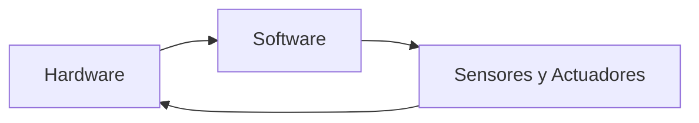
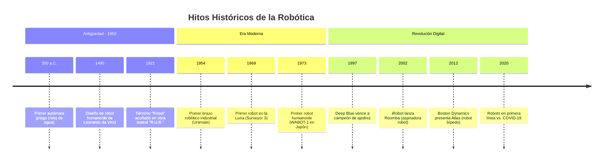

# 🤖 **Clase 1: Introducción a la Robótica**  
*Curso Introductorio de Electrónica y Robótica - Nivel Preparatoria*

> **Duración:** 60 minutos  
> **Nivel:** Principiante (16-18 años)  
> **Modalidad:** Online con actividades prácticas  
> **Prerrequisitos:** Ninguno - ¡Todos son bienvenidos!

---

## 🎯 **Objetivos de Aprendizaje**

Al finalizar esta clase, serás capaz de:
- ✅ **Definir** qué es la robótica y sus componentes fundamentales
- ✅ **Reconocer** los hitos históricos que dieron forma a la robótica moderna
- ✅ **Analizar** el impacto laboral actual y futuro de la robótica en diferentes industrias
- ✅ **Identificar** proyectos inspiradores que demuestran el potencial de esta tecnología
- ✅ **Reflexionar** sobre tu interés personal en la robótica y sus aplicaciones

---

## 📚 **Contenido de la Clase**

### 1. **¿Qué es la Robótica?** (15 minutos)

#### **Definición Oficial**
> **Robótica:** Ciencia y tecnología que estudia el diseño, construcción, operación y aplicación de robots, así como los sistemas informáticos para su control, retroalimentación sensorial y procesamiento de información.

#### **Los 3 Componentes Esenciales de Todo Robot**


- **🧱 Hardware:** Cuerpo físico del robot (estructura, motores, circuitos)
- **💻 Software:** Programas y algoritmos que le dan "inteligencia"
- **📡 Sensores y Actuadores:** 
  - *Sensores:* Ojos y oídos del robot (cámaras, sensores de distancia, tacto)
  - *Actuadores:* Músculos del robot (motores, servomotores, brazos mecánicos)

#### **Tipos de Robots que Encontrarás**
| Tipo | Ejemplos | Características |
|------|----------|----------------|
| ** Industriales** | Brazos robóticos en fábricas | Precisión, repetición, alta carga |
| **De Servicio** | Aspiradoras robot, robots de hospital | Interacción con humanos, autonomía |
| **Móviles** | Drones, coches autónomos | Navegación, sensores de entorno |
| **Humanoides** | ASIMO, Sophia | Imitan forma humana, complejos |

#### **💡 Reflexión Rápida**
> *¿Qué objetos de tu vida diaria crees que contienen tecnología robótica?*  
> (Ej: teléfono, carros modernos, electrodomésticos inteligentes)

---

### 2. **Historia de la Robótica** (15 minutos)

#### **Línea de Tiempo Interactiva**



#### **Personajes Clave**
- **Isaac Asimov:** Científico que definió las **3 Leyes de la Robótica** (1942):
  1. *Un robot no puede dañar a un humano o permitir que un humano sufra daño*
  2. *Debe obedecer las órdenes humanas (excepto si viola la 1ra ley)*
  3. *Debe proteger su propia existencia (si no viola las leyes 1 y 2)*

- **Joseph Engelberger:** "Padre de la robótica industrial" - fundó la primera empresa de robots industriales (Unimation)

- **Rodney Brooks:** Pionero en robótica móvil y director del Laboratorio de IA del MIT

#### **📽️ Video Recomendado (5 min)**
[**"Descubrimientos Antiguos - Robots de la antiguedad"** por The History Channel](https://www.youtube.com/watch?v=qZW1HQM2DAE)  
*Documental de The History Channel sobre mecanismos, automatas y maquinas programables de la antiguedad.*

---

### 3. **Impacto Laboral de la Robótica** (15 minutos)

#### **📊 Datos Reales 2026 (Proyecciones)**
- **Crecimiento del mercado:** +25% anual en robótica industrial (fuente: McKinsey 2025)
- **Nuevos empleos:** Se crearán **58 millones** de puestos relacionados con IA y robótica para 2030
- **Salarios promedio:** 
  - Técnico en robótica: $15,000 - $25,000 USD anuales
  - Ingeniero de robótica: $70,000 - $150,000 USD anuales
  - Especialista en IA para robots: $100,000 - $250,000 USD anuales

#### **Industrias Transformadas por la Robótica**
| Industria | Aplicaciones | Impacto en Empleos |
|-----------|--------------|-------------------|
| **Manufactura** | Ensamblaje, pintura, soldadura | +30% productividad, -15% empleos repetitivos |
| **Salud** | Cirugía robótica, rehabilitación | +50% precisión en cirugías, nuevos roles técnicos |
| **Agricultura** | Siembra autónoma, monitoreo de cultivos | -40% mano de obra manual, +60% empleos técnicos |
| **Logística** | Almacenes automatizados, drones de entrega | -25% empleos de picking, +200% empleos en mantenimiento |

#### **💡 Nota Importante para Estudiantes**
> **¡No te preocupes por los robots quitando empleos!**  
> Los estudios muestran que por cada empleo automatizado, se crean **2.3 nuevos empleos** en áreas que requieren:  
> - Creatividad humana  
> - Pensamiento crítico  
> - Habilidades sociales  
> - Mantenimiento y programación de robots

#### **🛠️ Habilidades Demandadas 2026-2030**


---

### 4. **Proyectos Inspiradores** (10 minutos)

#### **🌍 Proyectos que Cambian el Mundo**
1. **Zipline (Drones médicos)**  
   - **Qué hace:** Drones que entregan sangre y medicinas en zonas remotas de África
   - **Impacto:** Salvó +250,000 vidas desde 2016
   - **Tecnología:** GPS preciso, cámaras térmicas, baterías de larga duración

2. **ExoHand (Prótesis robótica)**  
   - **Qué hace:** Mano robótica controlada por señales musculares
   - **Impacto:** Devuelve movilidad a personas con amputaciones
   - **Tecnología:** Sensores EMG, actuadores neumáticos, aprendizaje automático

3. **Robot jardinero (MIT)**  
   - **Qué hace:** Detecta malas hierbas y las elimina sin químicos
   - **Impacto:** Reduce 90% el uso de pesticidas en agricultura
   - **Tecnología:** Visión por computadora, brazo robótico preciso

#### **🔥 Proyectos de Estudiantes que se Volvieron Reales**
- **Teenager de 17 años** que creó robot recolector de basura en océanos (premio Google Science Fair)
- **Equipo de preparatoria** que diseñó robot para ayudar a personas mayores a tomar medicamentos
- **Proyecto escolar** que se convirtió en startup de robots de limpieza solar

#### **🎬 Video Inspirador (3 min)**
[**"¿Este es el Futuro de la Medicina?"**](https://youtu.be/7u7zkAeQhjE?si=-y62-IArpGyZJzai)  
*Pequeños robots activados por campos magnéticos  podrán usarse en futuros procedimientos biomédicos.*

---

## 🎮 **¿Cómo se crea un Robot?"** (5 minutos)
Todo parte de la idea, y para ello... tenemos que seguir este procedimiento:

**Instrucciones:**  
1. Piensa en un problema.
2. Diseña mentalmente un robot que lo resuelva.
3. Responde estas preguntas:

```markdown
### 🤔 Diseño de Robot
**Nombre del robot:** _________________________

**Problema que resuelve:** 
_________________________________________
_________________________________________

**Componentes principales:**
- Sensores que necesitaría: _______________
- Actuadores que usaría: _________________
- Tecnología clave: ______________________

**Impacto social:** 
_________________________________________
_________________________________________
```

> **Si realmente lo resuelve:** ¡Entonces a fabricarlo!

---

## 📝 **Tarea Semanal**

### **Investigación Personal sobre Robótica**  
**Fecha de entrega:** Sábado antes de las 11:59 pm

**Instrucciones:**  
1. **Escribe un reporte a mano** (escaneado o fotografiado) respondiendo:
   - ¿Por qué te interesa aprender robótica?
   - ¿Qué impacto tiene la robótica en el mundo actual? (busca 3 ejemplos recientes)
   - Compara salarios y requisitos de 2 carreras relacionadas con robótica vs. otras carreras tradicionales
   - ¿Qué conocimientos necesitas para trabajar en robótica? (investiga en portales de empleo)

2. **Anexos digitales obligatorios:**
   - Captura de pantalla de tu investigación en portales de empleo (LinkedIn, Indeed, etc.)
   - Referencias bibliográficas completas (mínimo 3 fuentes confiables)

3. **Formato de referencias:**
   ```markdown
   Ejemplo:
   - McKinsey Global Institute. "The Future of Work in America". 2025. https://www.mckinsey.com/future-of-work
   - IEEE Spectrum. "Robotics Careers: What You Need to Know". 2026. https://spectrum.ieee.org/robotics-careers
   ```

---

## 📚 **Recursos Adicionales**

### **Videos Recomendados**
- [**"Este Robot Imparable Podría Salvarte La Vida"** - Veritasium (13 min)](https://youtu.be/v31bwARFRA4?si=DCIS1KISADt4LCx8)
- [**"Hombre Transforma Insectos MUERTOS en Asombrosos ROBOTS"** - Quantum Tech HD (12 min)](https://www.youtube.com/watch?v=kMIvYBAsgz4)

### **Lecturas Complementarias**
- **Artículo:** ["2025 Trends in Robotics"](https://www.computar.com/blog/2025-trends-in-robotics) - Computar Review
- **Artículo:** ["How to Get Started in Robotics"](https://robotsguide.com/learn/how-to-get-started-in-robotics) - Robots Guide

### **Herramientas para Explorar**
- **Simulador gratuito:** [Tinkercad Circuits](https://www.tinkercad.com/learn/circuits) - Para diseñar circuitos robóticos virtuales
- **Comunidad:** [Robotics Stack Exchange](https://robotics.stackexchange.com) - Foro de preguntas y respuestas
- **Noticias:** [IEEE Robotics & Automation Society](https://www.ieee-ras.org) - Últimas novedades en robótica

---

---

## 💡 **Tips para Tener Éxito en el Curso**

1. **Mantén curiosidad:** Pregunta TODO lo que no entiendas - ¡no hay preguntas tontas!
2. **Practica diariamente:** 15 minutos al día practicando circuitos virtuales > 3 horas de teoría una vez por semana
3. **Documenta todo:** Toma fotos de tus proyectos, anota errores y soluciones en tu cuaderno
4. **Colabora:** Forma equipos de estudio con compañeros - la robótica es un trabajo de equipo
5. **No temas fallar:** El 80% de los proyectos robóticos exitosos vienen de 20 intentos fallidos

---

## 🎓 **Conclusiones**

> *"Hace 50 años, los robots eran solo ciencia ficción. Hoy están en nuestros hogares, hospitales y fábricas. Ustedes son la generación que no solo usará estos robots, sino que los diseñará y programará para resolver los grandes desafíos de la humanidad. Este curso es el primer paso en ese viaje. Recuerden: cada gran inventor comenzó exactamente donde ustedes están ahora - con curiosidad y ganas de aprender."*


---

> **Material actualizado:** 21 de enero de 2026  
> **Versión:** 1.2 - Curso "Electrónica y Robótica para Preparatoria"