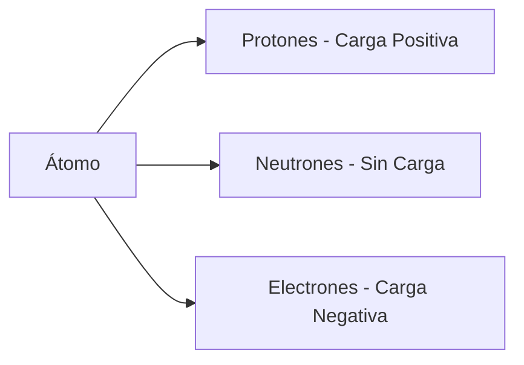
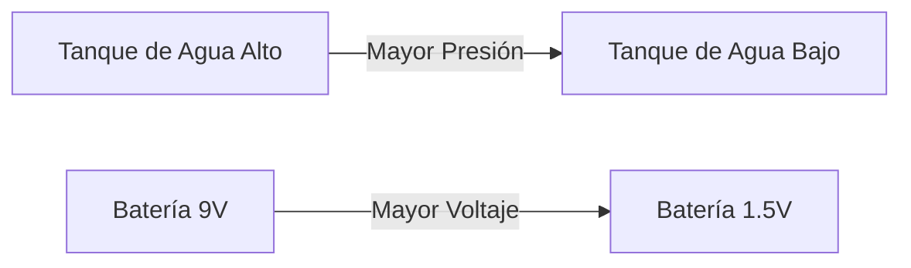
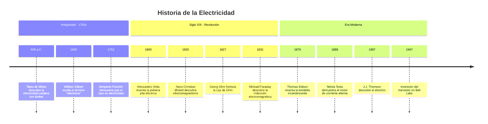
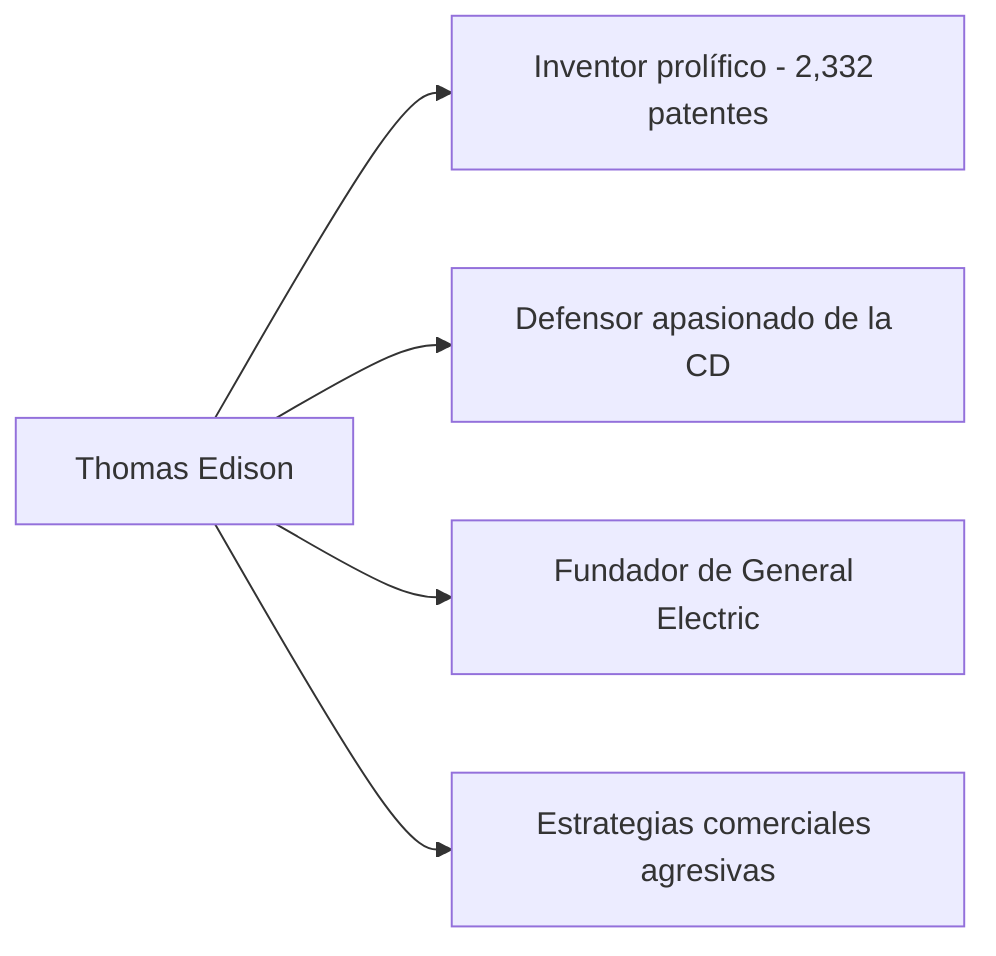
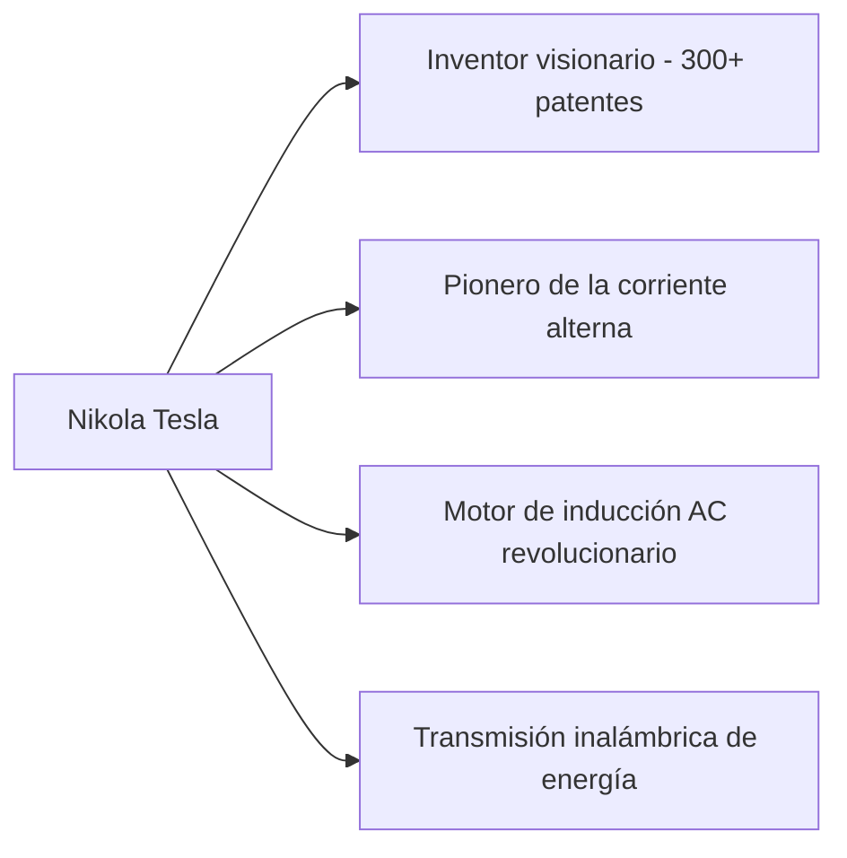

# ⚡ **Clase 2: Conceptos Básicos de la Electricidad**  
*Curso Introductorio de Electrónica y Robótica - Nivel Preparatoria*

> **Duración:** 60 minutos  
> **Nivel:** Principiante (16-18 años)  
> **Modalidad:** Online con actividades prácticas  
> **Prerrequisitos:** Clase 1 completada  
> **Materiales necesarios:** Cuaderno, lápiz, calculadora básica, acceso a YouTube

---

## 🎯 **Objetivos de Aprendizaje**

Al finalizar esta clase, serás capaz de:
- ✅ **Definir** los cuatro conceptos fundamentales de la electricidad: carga, corriente, voltaje y resistencia
- ✅ **Explicar** la diferencia entre corriente alterna (CA) y corriente directa (CD)
- ✅ **Reconocer** los hitos históricos más importantes en el desarrollo de la electricidad
- ✅ **Analizar** la "Guerra de las Corrientes" y su impacto en el mundo moderno
- ✅ **Valorar** las contribuciones de Nikola Tesla y Thomas Edison a la tecnología actual
- ✅ **Aplicar** conocimientos teóricos para comprender circuitos básicos

---

## 📚 **Contenido de la Clase**

### 1. **Definiciones Fundamentales de la Electricidad** (20 minutos)

#### **⚡ Carga Eléctrica (Q)**
**¿Qué es?**  
La carga eléctrica es una propiedad fundamental de la materia que causa fuerzas eléctricas entre objetos. Todo está hecho de átomos, y los átomos contienen partículas cargadas: **protones (+) y electrones (-)**.



**Características clave:**
- **Unidad de medida:** Coulomb (C)
- **Carga de un electrón:** -1.6 × 10⁻¹⁹ C
- **Ley fundamental:** Cargas iguales se repelen, cargas opuestas se atraen
- **Conservación:** La carga total en un sistema aislado permanece constante

**Ejemplo cotidiano:**  
Cuando te quitas un suéter de lana y tus cabellos se levantan, ¡es electricidad estática! Los electrones se transfieren del suéter a tu cabello, dejando cargas opuestas que se atraen.

---

#### **💧 Corriente Eléctrica (I)**
**¿Qué es?**  
La corriente eléctrica es el flujo ordenado de carga eléctrica a través de un conductor. Imagina el flujo de agua en una tubería.

**Definición matemática:**  
**I = Q / t**  
Donde:  
- I = Corriente (Amperes, A)  
- Q = Carga (Coulombs, C)  
- t = Tiempo (segundos, s)

**Tipos de corriente:**
| Tipo | Símbolo | Descripción | Ejemplos |
|------|---------|-------------|----------|
| **Corriente Directa (CD)** | DC | Flujo constante en UNA dirección | Baterías, paneles solares, USB |
| **Corriente Alterna (CA)** | AC | Flujo que cambia de dirección periódicamente | Tomacorrientes, red eléctrica |

**¡Dato importante!**  
Solo se necesita **0.1 Amperes** para detener el corazón humano. ¡La seguridad eléctrica es vital!

---

#### **🔋 Voltaje (V) - Diferencia de Potencial**
**¿Qué es?**  
El voltaje es la "presión" que impulsa a las cargas eléctricas a moverse a través de un circuito. Es la energía por unidad de carga.

**Definición matemática:**  
**V = E / Q**  
Donde:  
- V = Voltaje (Volts, V)  
- E = Energía (Joules, J)  
- Q = Carga (Coulombs, C)

**Analogía hidráulica:**  


**Valores comunes en la vida diaria:**
- Célula solar: 0.5V
- Batería AA: 1.5V
- USB: 5V
- Batería de carro: 12V
- Tomacorriente México: 127V
- Líneas de transmisión: 400,000V

---

#### **🚧 Resistencia (R)**
**¿Qué es?**  
La resistencia es la oposición que presenta un material al paso de la corriente eléctrica. Convierte energía eléctrica en calor.

**Definición matemática (Ley de Ohm):**  
**V = I × R**  
Donde:  
- V = Voltaje (Volts, V)  
- I = Corriente (Amperes, A)  
- R = Resistencia (Ohms, Ω)

**Factores que afectan la resistencia:**


**Ejemplos de resistividad:**
| Material | Resistividad (Ω·m) | Uso común |
|----------|-------------------|-----------|
| **Plata** | 1.59 × 10⁻⁸ | Contactos de alta calidad |
| **Cobre** | 1.68 × 10⁻⁸ | Cables eléctricos |
| **Hierro** | 9.7 × 10⁻⁸ | Estructuras |
| **Vidrio** | 10¹⁰ - 10¹⁴ | Aislantes |
| **Caucho** | 10¹³ - 10¹⁶ | Aislamiento de cables |

**¡Aplicación práctica!**  
Las resistencias en circuitos electrónicos limitan la corriente para proteger componentes como LEDs. Sin ellas, ¡los LEDs se queman en segundos!

---

### 2. **Historia de la Electricidad** (10 minutos)

#### **Línea de Tiempo de los Descubrimientos Clave**



#### **Descubrimientos que Cambiaron el Mundo**
- **Ámbar y electricidad estática (600 a.C.):** Los griegos notaron que al frotar ámbar con piel, atraía objetos ligeros.
- **Pila de Volta (1800):** Primera fuente confiable de corriente eléctrica continua, revolucionando los experimentos.
- **Electromagnetismo (1820):** Ørsted descubrió que una corriente eléctrica crea un campo magnético, uniendo electricidad y magnetismo.
- **Inducción electromagnética (1831):** Faraday demostró que un campo magnético variable induce corriente en un conductor - base de generadores y transformadores.

#### **💡 Reflexión Histórica**
> *"La electricidad no fue inventada, fue descubierta. La naturaleza siempre la tuvo; nosotros solo aprendimos a entenderla y usarla."*  
> - Adaptación de Michael Faraday

---

### 3. **La Guerra de las Corrientes** (20 minutos)

#### **⚡ Corriente Alterna (CA) vs Corriente Directa (CD)**

| Característica | Corriente Directa (CD) | Corriente Alterna (CA) |
|----------------|------------------------|------------------------|
| **Dirección del flujo** | Constante en una dirección | Cambia dirección periódicamente |
| **Voltaje** | Constante | Varía sinusoidalmente (ej: 127V RMS en México) |
| **Transmisión a larga distancia** | Pérdidas altas (>50%) | Pérdidas bajas (<10%) con transformadores |
| **Seguridad** | Más segura a bajos voltajes | Puede ser más peligrosa, pero se controla mejor |
| **Aplicaciones modernas** | Dispositivos electrónicos, baterías, LEDs | Red eléctrica, motores industriales, electrodomésticos |

**¿Por qué CA ganó para la transmisión?**  
Los transformadores solo funcionan con CA. Pueden **elevar** el voltaje para transmisión (reduciendo corriente y pérdidas) y luego **reducirlo** para uso doméstico.

**Ejemplo matemático:**  
Para transmitir 10,000W de potencia:
- A 100V: I = P/V = 100A → Pérdidas altas
- A 10,000V: I = 1A → Pérdidas mínimas

---

#### **👥 Thomas Edison vs Nikola Tesla: Dos Visiones Opuestas**

##### **Thomas Edison (1847-1931)**


**Logros principales:**
- ✅ Bombilla incandescente práctica (1879)
- ✅ Sistema eléctrico de CD completo (generadores, cables, lámparas)
- ✅ Fonógrafo, cine, batería de níquel-hierro
- ✅ Laboratorio de investigación industrial en Menlo Park

**Controversias:**
- ❌ Campaña de desprestigio contra la CA
- ❌ Demostraciones públicas electrocutando animales para mostrar "peligro" de CA
- ❌ No pagó adecuadamente a Nikola Tesla cuando trabajó para él

**Frase famosa:**  
*"El genio es un 1% de inspiración y un 99% de transpiración."*

---

##### **Nikola Tesla (1856-1943)**


**Logros principales:**
- ✅ Sistema polifásico de corriente alterna (base de la red eléctrica moderna)
- ✅ Motor de inducción AC (usado en 90% de las máquinas industriales hoy)
- ✅ Bobina de Tesla (alta frecuencia, alta tensión)
- ✅ Primeros experimentos con radiocontrol y energía inalámbrica
- ✅ Diseño de la primera planta hidroeléctrica en Niagara Falls (1895)

**Tragedias personales:**
- ❌ Murió pobre en un hotel de Nueva York
- ❌ Muchas de sus ideas fueron robadas o no reconocidas
- ❌ Su laboratorio fue destruido en un incendio sospechoso
- ❌ Nunca recibió el Premio Nobel que muchos creían merecía

**Frase famosa:**  
*"El presente es de ellos; el futuro, del que cree en la belleza de sus sueños."*

---

#### **🎬 Video Recomendado (7 minutos)**
[**"The War of the Currents: Edison vs Tesla"** por Veritasium](https://www.youtube.com/watch?v=xKQ6h4wQjXo)  
*Documental visual que explica la batalla comercial y técnica entre ambos inventores*

---

### 4. **Tarea Semanal** (10 minutos)

#### **🔍 Investigación: 10 Puntos Clave sobre Nikola Tesla**

**Instrucciones:**  
1. **Ver el video completo:**  
   🔗 ["#1 Biografías científicas - Nikola Tesla, el mago de la electricidad" - Date un Vlog](https://www.youtube.com/watch?v=URL_DEL_VIDEO)  
   *(Nota: El profesor proporcionará el enlace exacto en el aula virtual)*

2. **Extraer 10 puntos importantes** del video, considerando estos aspectos:
   - Logros científicos y tecnológicos
   - Dificultades personales y profesionales
   - Relación con Thomas Edison y George Westinghouse
   - Contribuciones que usamos hoy en día
   - Ideas visionarias que parecían imposibles en su época
   - Datos curiosos o poco conocidos sobre su vida

3. **Formato de entrega:**
   - **Reporte escrito a mano** en tu cuaderno (escaneado o fotografiado)
   - **Portada** con: nombre, grupo, fecha, título de la tarea
   - **10 puntos numerados** con explicaciones breves (máximo 2 líneas por punto)
   - **Conclusión personal** (3-4 líneas): ¿Qué te impactó más de Tesla y por qué?

4. **Referencias obligatorias:**
   ```markdown
   Referencia del video:
   Date un Vlog. "#1 Biografías científicas - Nikola Tesla, el mago de la electricidad". 2024. https://www.youtube.com/watch?v=URL_DEL_VIDEO
   
   Referencias adicionales (mínimo 1):
   [Autor]. [Título del artículo/libro]. [Año]. [URL si aplica]
   ```

**Rúbrica de evaluación:**
- ✅ **5 puntos:** Calidad y profundidad de los 10 puntos extraídos
- ✅ **3 puntos:** Formato correcto y presentación del reporte
- ✅ **2 puntos:** Referencias completas y conclusiones personales

**Fecha límite:** Sábado antes de las 11:59 pm

---


## 📚 **Recursos Adicionales**

### **Videos Recomendados**
- [**"Electricidad Básica para Principiantes"** - Date un Vlog (15 min)](https://www.youtube.com/watch?v=electricidad_basica)
- [**"Ley de Ohm Explicada con Ejemplos"** - Khan Academy (8 min)](https://www.youtube.com/watch?v=ley_ohm)
- [**"La Vida Secreta de Nikola Tesla"** - Documental BBC (45 min)](https://www.youtube.com/watch?v=tesla_documental)

### **Lecturas Complementarias**
- **Artículo:** ["Tesla vs Edison: The Truth Behind the War of Currents"](https://www.scientificamerican.com/article/tesla-vs-edison) - Scientific American
- **Libro:** *"Tesla: Inventor of the Modern"* de Richard Munson (capítulos 1-3)
- **Infografía:** ["The Physics of Electricity"](https://www.physicsclassroom.com/infographics/electricity) - Physics Classroom

### **Simuladores Interactivos**
- **PhET Interactive Simulations:** [Circuit Construction Kit](https://phet.colorado.edu/sims/html/circuit-construction-kit-dc/latest/circuit-construction-kit-dc_es.html)  
  *Construye circuitos virtuales y ve cómo fluyen los electrones*
  
- **Falstad Circuit Simulator:** [Simulador de Circuitos Online](https://www.falstad.com/circuit/)  
  *Visualiza corriente alterna y directa en tiempo real*

---

## 🔔 **Próxima Clase: Ley de Ohm y Circuitos en Serie/Paralelo**  
*(Martes 27 de Enero - 7:00 am)*

**Temas que veremos:**  
🔧 **Ley de Ohm en profundidad** con ejemplos prácticos  
🔧 **Circuitos en serie vs paralelo** - ventajas y desventajas de cada uno  
🔧 **Práctica con multímetro:** Mediremos resistencias y voltajes en circuitos reales  
🔧 **Proyecto mini:** Construiremos un circuito de luces LED con diferentes configuraciones

**Materiales para traer:**  
- Multímetro
- 10 resistencias de diferentes valores (220Ω, 470Ω, 1kΩ, 10kΩ)
- LEDs de colores diferentes
- Protoboard pequeño
- Cables jumper
- 4 pilas AA


## 🎓 **Conclusiones**

> *"La electricidad es invisible, pero está en todo lo que nos rodea. Entender sus conceptos básicos no solo te permitirá construir circuitos, sino que te dará el poder de interpretar el mundo tecnológico en el que vivimos. Nikola Tesla decía que 'si quieres descubrir los secretos del universo, piensa en términos de energía, frecuencia y vibración'. Hoy damos el primer paso en ese viaje de descubrimiento. Recuerden: cada gran ingeniero, inventor o científico comenzó exactamente donde ustedes están ahora - con curiosidad y ganas de aprender."*

**¡Hasta la próxima clase!** ⚡

---

> **Contacto del Profesor:**  
> 📧 profesor.robotica@curso.edu  
> 💬 WhatsApp: +52 1 55 1234 5678  
> 🌐 Horario de dudas: Lunes a viernes 4-6 pm  
> 
> **Material actualizado:** 21 de enero de 2026  
> **Versión:** 1.3 - Curso "Electrónica y Robótica para Preparatoria"  
> **Notas adicionales:** Para estudiantes que no puedan ver el video, se proporcionará material alternativo en el aula virtual.